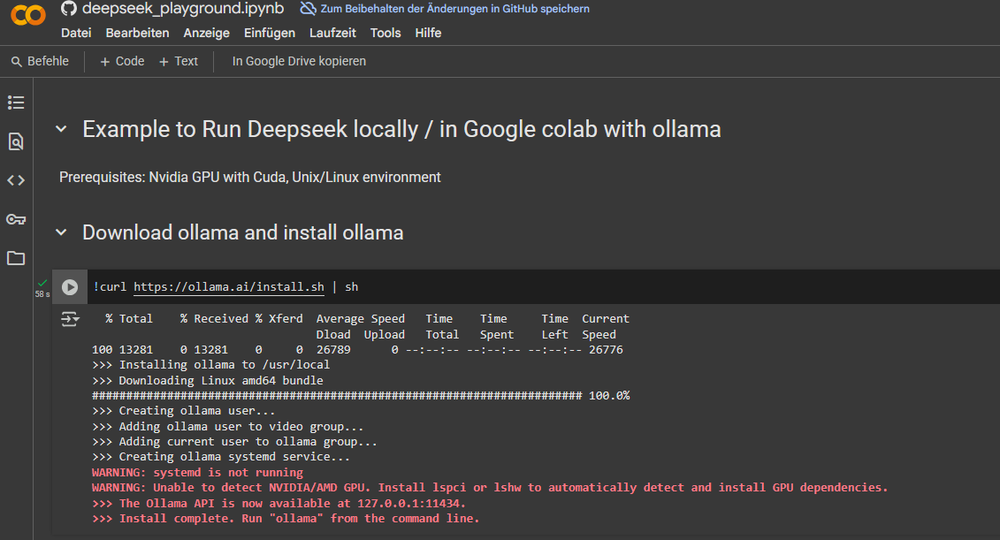
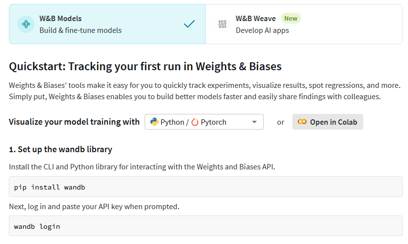
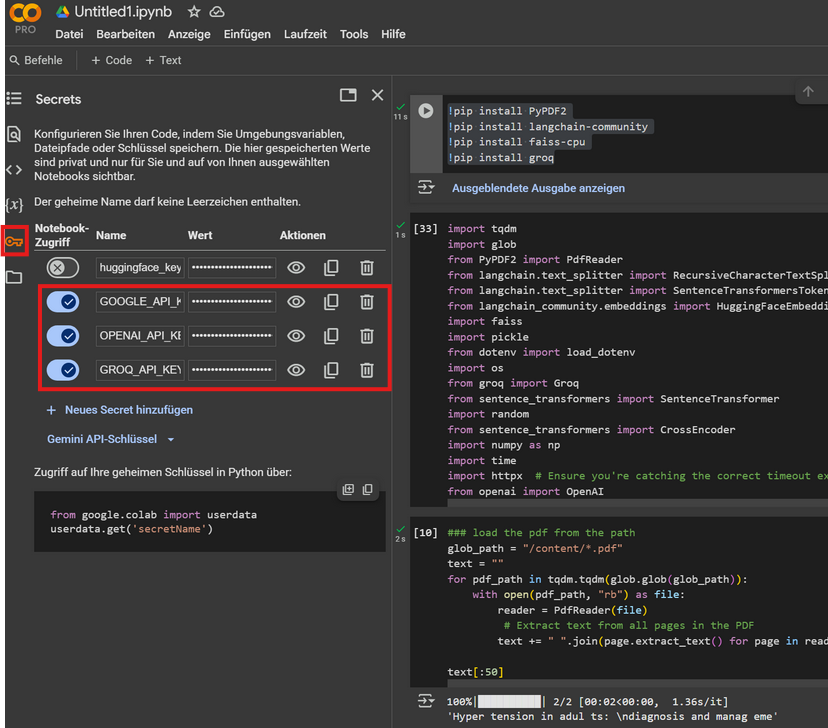

# Pip install for the REG

## Overview and Description
1. **AI & LLMs**
```bash
pip install ollama #ollama – Interface for running and managing local LLMs via Ollama (used for local model inference).
pip install google-generativeai #google.generativeai – Google's Gemini model SDK for text and multimodal generation.
pip install openai #openai – Official OpenAI API client (used for ChatGPT, GPT-4, embeddings, etc.).
pip install groq #groq – SDK to access Groq’s ultra-fast inference API for running LLMs like LLaMA-3.
```

2. **Async + System Utilities**
```bash
pip install python-dotenv #pip install python-dotenv
pip install nest_asyncio #nest_asyncio – Allows nested asyncio loops (useful when using asyncio inside notebooks or environments that already run an event loop).
```

3. **PDF Reading and File Handling**
```bash
pip install PyPDF2 #PyPDF2 – Read and extract text from PDF files.
pip install glob2 #glob – Standard Python library for file matching; glob2 extends it. You don't need to install glob separately unless using extended functionality.
```

4. **LangChain Ecosystem**
```bash
pip install langchain #langchain – Core framework for chaining LLM interactions with tools like memory, prompt templates, retrievers, etc.
pip install langchain-google-genai #langchain-google-genai – Integrates Google’s Gemini with LangChain.
pip install langchain-community #langchain_community – Community-contributed integrations like FAISS, HuggingFaceEmbeddings, etc.
```

5. **Embeddings + Transformers**
```bash
pip install sentence-transformers #sentence_transformers – For creating high-quality sentence embeddings (e.g., for search and clustering).
pip install huggingface-hub #HuggingFaceEmbeddings – Used in LangChain to fetch embedding models from Hugging Face.
```

6. **Vector Store**
```bash
pip install faiss-cpu #faiss – Vector database for similarity search. Use faiss-cpu for CPU-only systems.
pip install pickle5 #pickle – Standard library, but pickle5 is sometimes used for extended features or compatibility in older environments.
```

7. **Visualization**
```bash
pip install matplotlib #matplotlib – Visualization library, used here possibly for plotting embeddings (e.g., after UMAP dimensionality reduction).
pip install umap-learn #umap.umap_ – Dimensionality reduction technique for visualizing high-dimensional embeddings (e.g., from sentence transformers).
```

8. **Others**
```bash
pip install weave #weave – Tool for observability and visual debugging of ML apps (optional, depending on your use).
pip install tqdm #tqdm – Progress bar utility for loops (useful when processing many documents).
```

## 📋 Import-to-Package Mapping

This table helps you understand which `pip install` or `!pip install` command is required for each Python import used in this project.

| **Import** | **pip install** | **Description** |
|------------|------------------|-----------------|
| `import ollama` | `pip install ollama` | Local LLM runner and manager |
| `import google.generativeai as genai` | `pip install google-generativeai` | Access Google's Gemini AI models |
| `from openai import OpenAI` | `pip install openai` | OpenAI API client (GPT-4, embeddings, etc.) |
| `from groq import Groq` | `pip install groq` | Access Groq’s fast LLMs (e.g., LLaMA-3) |
| `from dotenv import load_dotenv` | `pip install python-dotenv` | Load environment variables from `.env` |
| `import nest_asyncio` | `pip install nest_asyncio` | Allow nested asyncio event loops |
| `import weave` | `pip install weave` | Visual observability for ML workflows |
| `from PyPDF2 import PdfReader` | `pip install PyPDF2` | Read and extract text from PDF files |
| `import glob` | *Standard Library* | File pattern matching (no install needed) |
| `from langchain.text_splitter import RecursiveCharacterTextSplitter` | `pip install langchain` | LangChain text splitter for chunking |
| `from langchain.text_splitter import SentenceTransformersTokenTextSplitter` | `pip install langchain` + `pip install sentence-transformers` | Token-aware text splitting |
| `from langchain_community.embeddings import HuggingFaceEmbeddings` | `pip install langchain-community` + `pip install huggingface-hub` | HuggingFace embeddings in LangChain |
| `from langchain_google_genai import ChatGoogleGenerativeA` | `pip install langchain-google-genai` | Gemini chat model in LangChain |
| `from langchain_community.vectorstores import FAISS` | `pip install langchain-community` + `pip install faiss-cpu` | FAISS vector search in LangChain |
| `from langchain_core.prompts import ChatPromptTemplate` | `pip install langchain` | LangChain core prompt structuring |
| `from langchain_core.messages import HumanMessage, AIMessage` | `pip install langchain` | Message types for conversations |
| `from langchain_core.output_parsers import StrOutputParser` | `pip install langchain` | Output parsing for string responses |
| `from langchain_core.runnables import RunnableBranch, RunnablePassthrough` | `pip install langchain` | Control flow in LangChain chains |
| `from sentence_transformers import SentenceTransformer` | `pip install sentence-transformers` | Embedding model loader |
| `from sentence_transformers import CrossEncoder` | `pip install sentence-transformers` | Scoring pairs of sentences |
| `import faiss` | `pip install faiss-cpu` | Vector similarity search |
| `import pickle` | *Standard Library* | Serialize and save objects |
| `import matplotlib.pyplot as plt` | `pip install matplotlib` | Create plots and charts |
| `import umap.umap_ as umap` | `pip install umap-learn` | Dimensionality reduction |
| `import numpy as np` | `pip install numpy` | Numeric computing and arrays |
| `import tqdm` | `pip install tqdm` | Progress bars in loops |
| `import random` | *Standard Library* | Random number utilities |

## 🛠️ Troubleshooting & Forced Installation

If you encounter errors like: ModuleNotFoundError: No module named 'xyz'

Follow these steps to fix the issue:
---

### 1. Install the Missing Package

```bash
pip install xyz
```

### 2. Force Reinstallation
```bash
pip install --force-reinstall xyz
```

### 3. Upgrade the Package
```bash
pip install --upgrade xyz
```

### 4. Install a Specific Version
```bash
pip install xyz==1.2.3
```

### 5. Uninstall and Reinstall
```bash
pip uninstall xyz
pip install xyz
```
---

# .env Datei

Für API-Schlüssel usw.

```env
OPENAI_API_KEY=dein_openai_api_key
GOOGLE_API_KEY=dein_google_api_key
GROQ_API_KEY=dein_groq_api_key
```
---
## Laden der Variablen im Code

```python
from dotenv import load_dotenv
import os

load_dotenv()  # Lädt die Variablen aus .env
google_api_key = os.getenv("GOOGLE_API_KEY")
openai_api_key = os.getenv("OPENAI_API_KEY")
groq_api_key = os.getenv("GROQ_API_KEY")
```

# LLM_Calls

## Google
```python
import google.generativeai as genai
genai.configure(api_key=google_api_key)
model = genai.GenerativeModel(
    "models/gemini-2.0-flash",
    system_instruction="You are a cat. Your name is Neko.",
)

chat = model.start_chat()
response = chat.send_message("Good day fine chatbot")
print(response.text)
```
---
## Openai
```python
from openai import OpenAI
client = OpenAI(api_key=openai_api_key)

completion = client.chat.completions.create(
    model="gpt-4o-mini",
    messages=[
        {"role": "developer", "content": "You are a helpful assistant."},
        {
            "role": "user",
            "content": "Write a haiku about recursion in programming."
        }
    ]
)

print(completion.choices[0].message)
```
---
## Groq
```python
from groq import Groq

client = Groq(api_key=groq_api_key)

llm = client.chat.completions.create(
    messages=[
        {
            "role": "system",
            "content": "You are a helpful AI Assistant. You explain ever \
            topic the user asks as if you are explaining it to a 5 year old"
        },
        {
            "role": "user",
            "content": "What are Black Holes?",
        }
    ],
    model="mixtral-8x7b-32768",
)

print(llm.choices[0].message.content)
```
# Deepseek
https://github.com/zhaw-iwi/LLM-intro-solution/blob/main/deepseek_playground.ipynb 

## GPU in Colab aktivieren 
Menü: Laufzeit (Runtime) → Laufzeittyp ändern (Change runtime type)
Wähle GPU unter "Hardwarebeschleuniger"
---
### CUBA und ollama



kann wie folgt gelöst werden:

```bash
!nvidia-smi #prüft ob GPU verfügbar ist
!apt-get install -y pciutils lshw # installiert fehlende tools
!ollama run llama2 # testen ob ollama die GPU erkennt
!curl https://ollama.ai/install.sh | sh
!sudo apt install -y cuda-drivers
```
#### cuda drivers laden & installieren

```bash
!echo 'debconf debconf/frontend select Noninteractive' | sudo debconf-set-selections
!sudo apt-get update && sudo apt-get install -y cuda-drivers

# Kontrollieren ob cuda drivers funktionieren
import os

# Set LD_LIBRARY_PATH so the system NVIDIA library
os.environ.update({'LD_LIBRARY_PATH': '/usr/lib64-nvidia'})
```
#### Start Ollama

```bash
!nohup ollama serve & #nohup is a command line expression that prevents a process from stopping after exiting the terminal.
```

#### Download Model

```bash
!ollama pull deepseek-r1:7b # Deepseek 
!ollama pull llama2 #llama2
!ollama pull deepseek-coder:6.7b # Deepseek -> wenn 7b nicht verfügbar

```
#### pip install ollama in Python
```bash
!pip install ollama
```
#### Beispiel request
```python
import ollama
response = ollama.chat(model='deepseek-r1:7b', messages=[
  {
    'role': 'user',
    'content': "How many r's are in a strawberry?",
  },
])
print(response['message']['content'])
```

# RAG
## rag with gemini
https://github.com/zhaw-iwi/rag-with-vector-solution/blob/main/rag_wit_gemini.ipynb

### Pfad anpassen
```python
# Beliebieger Dateityp 
from google.colab import files
uploaded = files.upload()  # Beliebiger Dateityp z.B. PDF, CSV, JPG, PNG, TXT, JSON, etc. hochladen
# PDF
import fitz 
pdf_path = file_path
# CSV
import pandas as pd
csv_path = file_path
# JPG, PNG
from PIL import Image
import matplotlib.pyplot as plt
image_path = file_path
# TXT
txt_path = file_path 
# JSON
import json
json_path = file_path

# Direkter File import
pdf_path = "/content/*.pdf"
csv_path = "/content/*.csv"
image_path = "/content/*.jpg"
txt_path = "/content/*.txt"
json_path = "/content/*.json"
```
### Daten auslesen
```python
# PDF
from PyPDF2 import PdfReader

pdf_path = "data/nihms-1901028.pdf"

with open(pdf_path, "rb") as file:
    reader = PdfReader(file)
    text = "".join(page.extract_text() for page in reader.pages if page.extract_text())

text

# CSV
import pandas as pd

csv_path = "data/daten.csv"

with open(csv_path, "r", encoding="utf-8") as file:
    df = pd.read_csv(file)

df.head()

# TXT
txt_path = "data/notizen.txt"

with open(txt_path, "r", encoding="utf-8") as file:
    text = file.read()

text

# JSON
import json

json_path = "data/config.json"

with open(json_path, "r", encoding="utf-8") as file:
    data = json.load(file)

data

#PNG, JPG
from PIL import Image
import matplotlib.pyplot as plt

image_path = "data/bild.jpg"

with open(image_path, "rb") as file:
    img = Image.open(file)
    img.load()

plt.imshow(img)
plt.axis('off')
plt.show()

# WAV
from scipy.io import wavfile

audio_path = "data/audio.wav"

with open(audio_path, "rb") as file:
    rate, data = wavfile.read(file)

rate, data.shape
```
### Text aufteilen
```python
# PDF
from PyPDF2 import PdfReader
from langchain.text_splitter import RecursiveCharacterTextSplitter

pdf_path = "data/nihms-1901028.pdf"

with open(pdf_path, "rb") as file:
    reader = PdfReader(file)
    text = "".join(page.extract_text() for page in reader.pages if page.extract_text())

splitter = RecursiveCharacterTextSplitter(chunk_size=2000, chunk_overlap=200)
chunks = splitter.split_text(text)

print(chunks)
print(len(chunks))

# CSV nur Textspalten
import pandas as pd
from langchain.text_splitter import RecursiveCharacterTextSplitter

csv_path = "data/daten.csv"

with open(csv_path, "r", encoding="utf-8") as file:
    df = pd.read_csv(file)

# Kombiniere alle Textspalten zu einem großen String
text = "\n".join(df.astype(str).apply(lambda row: " ".join(row), axis=1))

splitter = RecursiveCharacterTextSplitter(chunk_size=2000, chunk_overlap=200)
chunks = splitter.split_text(text)

print(chunks)
print(len(chunks))

# TXT
txt_path = "data/notizen.txt"
from langchain.text_splitter import RecursiveCharacterTextSplitter

with open(txt_path, "r", encoding="utf-8") as file:
    text = file.read()

splitter = RecursiveCharacterTextSplitter(chunk_size=2000, chunk_overlap=200)
chunks = splitter.split_text(text)

print(chunks)
print(len(chunks))

# JSON nur textuelle Inhalte
import json
from langchain.text_splitter import RecursiveCharacterTextSplitter

json_path = "data/config.json"

with open(json_path, "r", encoding="utf-8") as file:
    data = json.load(file)

# Konvertiere alles rekursiv zu String
def extract_text_from_json(obj):
    if isinstance(obj, dict):
        return " ".join([extract_text_from_json(v) for v in obj.values()])
    elif isinstance(obj, list):
        return " ".join([extract_text_from_json(i) for i in obj])
    else:
        return str(obj)

text = extract_text_from_json(data)

splitter = RecursiveCharacterTextSplitter(chunk_size=2000, chunk_overlap=200)
chunks = splitter.split_text(text)

print(chunks)
print(len(chunks))

# Bild OCR erforderlich
!apt install tesseract-ocr
from PIL import Image
import pytesseract
from langchain.text_splitter import RecursiveCharacterTextSplitter

image_path = "data/bild.jpg"

with open(image_path, "rb") as file:
    img = Image.open(file)
    img.load()

# OCR: Text aus Bild extrahieren
text = pytesseract.image_to_string(img)

splitter = RecursiveCharacterTextSplitter(chunk_size=2000, chunk_overlap=200)
chunks = splitter.split_text(text)

print(chunks)
print(len(chunks))
```
### Speicher in Vector Store

```python
# Allgemein
!pip install langchain faiss-cpu google-generativeai PyPDF2 pytesseract Pillow pandas whisper

import os
from langchain.text_splitter import RecursiveCharacterTextSplitter
from langchain.vectorstores import FAISS
from langchain.embeddings import GoogleGenerativeAIEmbeddings

# Google_API_KEY laden
# PDF
from PyPDF2 import PdfReader

pdf_path = "data/nihms-1901028.pdf"

with open(pdf_path, "rb") as file:
    reader = PdfReader(file)
    text = "".join(page.extract_text() for page in reader.pages if page.extract_text())

splitter = RecursiveCharacterTextSplitter(chunk_size=2000, chunk_overlap=200)
chunks = splitter.split_text(text)

embeddings = GoogleGenerativeAIEmbeddings(model="models/embedding-001")
vector_store = FAISS.from_texts(chunks, embedding=embeddings)
vector_store.save_local("faiss_index_pdf")

# CSV
import pandas as pd

csv_path = "data/daten.csv"

with open(csv_path, "r", encoding="utf-8") as file:
    df = pd.read_csv(file)

text = "\n".join(df.astype(str).apply(lambda row: " ".join(row), axis=1))

splitter = RecursiveCharacterTextSplitter(chunk_size=2000, chunk_overlap=200)
chunks = splitter.split_text(text)

embeddings = GoogleGenerativeAIEmbeddings(model="models/embedding-001")
vector_store = FAISS.from_texts(chunks, embedding=embeddings)
vector_store.save_local("faiss_index_csv")

# TXT
txt_path = "data/notizen.txt"

with open(txt_path, "r", encoding="utf-8") as file:
    text = file.read()

splitter = RecursiveCharacterTextSplitter(chunk_size=2000, chunk_overlap=200)
chunks = splitter.split_text(text)

embeddings = GoogleGenerativeAIEmbeddings(model="models/embedding-001")
vector_store = FAISS.from_texts(chunks, embedding=embeddings)
vector_store.save_local("faiss_index_txt")

# JSON
import json

json_path = "data/config.json"

with open(json_path, "r", encoding="utf-8") as file:
    data = json.load(file)

def extract_text_from_json(obj):
    if isinstance(obj, dict):
        return " ".join([extract_text_from_json(v) for v in obj.values()])
    elif isinstance(obj, list):
        return " ".join([extract_text_from_json(i) for i in obj])
    else:
        return str(obj)

text = extract_text_from_json(data)

splitter = RecursiveCharacterTextSplitter(chunk_size=2000, chunk_overlap=200)
chunks = splitter.split_text(text)

embeddings = GoogleGenerativeAIEmbeddings(model="models/embedding-001")
vector_store = FAISS.from_texts(chunks, embedding=embeddings)
vector_store.save_local("faiss_index_json")

# Bild (OCR)
from PIL import Image
import pytesseract

image_path = "data/bild.jpg"

with open(image_path, "rb") as file:
    img = Image.open(file)
    img.load()

text = pytesseract.image_to_string(img)

splitter = RecursiveCharacterTextSplitter(chunk_size=2000, chunk_overlap=200)
chunks = splitter.split_text(text)

embeddings = GoogleGenerativeAIEmbeddings(model="models/embedding-001")
vector_store = FAISS.from_texts(chunks, embedding=embeddings)
vector_store.save_local("faiss_index_image")

```

### Weave Tracking
#### Vorbereitung & Login Wandb
https://wandb.ai/authorize

1. Neues Projekt erstellen
2. Quickstart Menu folgen 



```bash
pip install wandb
wandb login
# API Key kopieren und eingeben wenn aufgefordert
```
Möglicher Fehler
```bash
weave version 0.51.44 is available! To upgrade, please run:
$ pip install weave --upgrade
```
Update
```bash
!pip install --upgrade weave

```

Erhaltenen Key in Command Line kopieren

```python

```


---


## rag and embeddings 
https://github.com/zhaw-iwi/rag-and-embeddings-solution/blob/main/RAG-and-embeddings-solution.ipynb


## rag advanced
https://github.com/zhaw-iwi/advanced-rag-solution

```bash
!pip install PyPDF2
!pip install langchain-community
!pip install faiss-cpu
!pip install groq
```
### API Key hinterlegen in Colab



### Imports dotenv nicht nötig
```python
from google.colab import userdata
google_api_key = userdata.get('GOOGLE_API_KEY')
openai_api_key = userdata.get('OPENAI_API_KEY')
groq_api_key = userdata.get('GROQ_API_KEY')
```
### Pfad anpassen
```bash
glob_path = "/content/*.pdf"
```

```bash
```

```bash
```

```bash
```

```bash
```

```bash
```